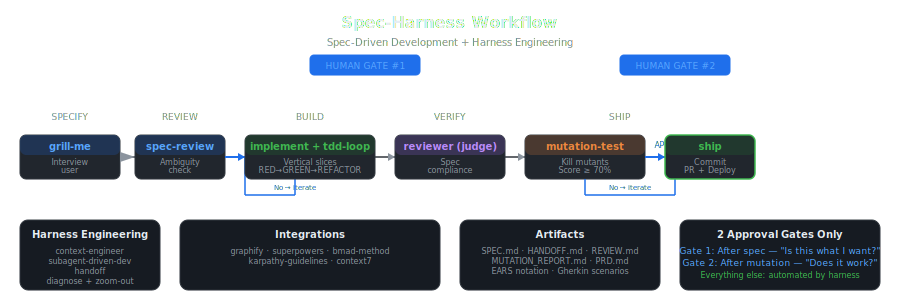

# Spec-Harness | [English](./README.md) · [Español](./README.es.md)


**面向 AI 编程智能体的 Spec-Driven Development + Harness Engineering。**

一个可组合的技能系统，将 **Spec-Driven Development（规范驱动开发）**（以规范为事实来源）与 **Harness Engineering（测试工程）**（自动化护栏、上下文精简、验证循环）相结合——通过综合生产级 AI 工作流中的真实模式设计。

适用于 **Claude Code**、**Codex**、**OpenCode**、**Cursor**、**Gemini CLI**，以及任何支持读取 markdown 技能文件的智能体。

---

## 工作流图



### 仅 2 道人工关卡

- **第一关：** `/spec-author` 之后 — "这是我要的吗？"
- **第二关：** `/mutation-test` 之后 — "它能工作吗？"

关卡之间的一切由 harness 自动执行。

---

## 完整示例

| 示例 | 展示内容 |
|------|----------|
| [`examples/01-user-auth/`](examples/01-user-auth/) | 完整流程：认证系统，4 个需求。所有产物均已生成 — SPEC.md、REVIEW.md、MUTATION_REPORT.md 及实现提交 |
| [`examples/02-api-rate-limit/`](examples/02-api-rate-limit/) | 最小规范：API 限流中间件（2 个需求）。展示流程可精简，亦可扩展 |

---

## 快速上手

### 3 步

```bash
# 1. 安装 / Install
git clone https://github.com/Guillermo-Mtz-M/spec-harness.git && cd spec-harness && node scripts/install.js --target claude

# 2. 访谈 / Interview
# 输入 /grill-me — 智能体连环追问，直到弄清楚你真正想要什么

# 3. 编写规范 / Specify
# /spec-author 以 EARS/Gherkin 格式编写 SPEC.md
# → [人工审批]
# → [实现 / Implement]
# → [验证 / Verify]
# → /ship
```

### 支持的智能体

| 智能体 | 安装方式 |
|--------|----------|
| Claude Code | `node scripts/install.js --target claude` |
| OpenCode | `node scripts/install.js --target opencode` |
| Cursor | `node scripts/install.js --target cursor` |
| Gemini CLI | `gemini extensions install https://github.com/Guillermo-Mtz-M/spec-harness` |

---

## 工作流

```
  SPECIFY          REVIEW           BUILD           VERIFY           SHIP
 ┌────────┐      ┌────────┐      ┌────────┐      ┌────────┐      ┌────────┐
 │ grills │ ───▶ │  spec  │ ───▶ │   TDD  │ ───▶ │ judge  │ ───▶ │  human │
 │  user  │      │ review │      │  loop  │      │ mutate │      │ approve│
 └────────┘      └────────┘      └────────┘      └────────┘      └────────┘
   /grill-me       /spec-review     /implement       /mutation-test    /ship
        └──── /spec-author ────┘   └──── /tdd-loop ─┘   └── /reviewer ─┘
```

**人工审批关卡（仅 2 道）：**
1. **规范审批后** — "这是我要的吗？"
2. **验证完成后** — "它能工作吗？"

---

## 技能（15 个）

| 技能 | 功能 | 使用时机 |
|------|------|----------|
| `/grill-me` | 连环访谈 — 挖掘你真正想要的东西 | 开始任何非平凡任务时 |
| `/spec-author` | 以 EARS/Gherkin 编写规范，含验收标准 | 访谈完成后、编码前 |
| `/spec-review` | 基于上下文精简的规范审查（模糊度清单） | 审批规范前 |
| `/implement` | 薄垂直切片 + TDD，按切片提交 | 规范已审批，开始构建 |
| `/tdd-loop` | RED-GREEN-REFACTOR 循环，含验证关卡 | 实现过程中 |
| `/reviewer` | 裁判：代码是否满足规范？ | 实现完成后 |
| `/council-review` | 3 个匿名专家审查（规范合规性、性能/边界、安全性）→ 主席综合 | reviewer 之后，mutation-test 之前 |
| `/mutation-test` | 杀死变异体或修复测试（≥70% 分数要求） | council-review 批准后 |
| `/ship` | 提交、PR、changelog、部署清单 | 所有验证通过后 |
| `/context-engineer` | 上下文精简、渐进加载、外部记忆 | 会话开始、上下文膨胀时 |
| `/subagent-driven-dev` | 通过 artifact 分派独立的 fresh 智能体 | 多切片规范 |
| `/handoff` | 将会话压缩为 HANDOFF.md 给下一个智能体 | 切换智能体、上下文重置 |
| `/diagnose` | 复现 → 定位 → 假设 → 修复 → 防护 | Bug 或回归问题 |
| `/zoom-out` | 系统级代码视图，发现深化机会 | 迷失在细节中时 |
| `/using-spec-harness` | 将任务映射到正确的技能路径 | 会话开始 |

---

## 集成（5 个）

| 集成 | 增加的功能 | 配置方式 |
|------|-----------|----------|
| [`graphify`](integrations/graphify/) | 知识图谱 — 查询 token 减少 71 倍 | `pip install graphifyy && graphify install` |
| [`superpowers`](integrations/superpowers/) | Brainstorm → plan → execute，含 git worktrees | Plugin install |
| [`bmad-method`](integrations/bmad-method/) | 12+ 专业智能体，尺度自适应规划 | `npx bmad-method install` |
| [`karpathy-guidelines`](integrations/karpathy-guidelines/) | coding 前思考、简约优先、精准改动 | 复制到 CLAUDE.md |
| [`context7`](integrations/context7/) | 通过 MCP 获取最新库文档 — 避免幻觉 API | `npx ctx7 setup` |

---

## 智能体角色（5 个）

| 智能体 | 角色 | 判定 |
|--------|------|------|
| [`spec-author`](agents/spec-author.md) | 需求工程师 | EARS 标注 |
| [`implementer`](agents/implementer.md) | 高级开发者 | TDD、YAGNI、精准改动 |
| [`judge`](agents/judge.md) | 代码审查员 | 每需求 PASS / FAIL / PARTIAL |
| [`mutation-tester`](agents/mutation-tester.md) | QA 对抗方 | 变异分数 ≥ 70% |
| [`council-chairman`](agents/council-chairman.md) | 综合仲裁者 | 匿名审查的统一裁决 |

---

## 设计原则

```
1. 规范是事实来源     → 无规范 = 无代码。仅限 EARS/Gherkin。
2. 上下文是预算       → 每个智能体最小化。通过 artifact 交接。
3. 子智能体，非单体    → Fresh 上下文 = 更好的决策。
4. 验证是强制性的     → "看起来对" 不被接受。展示测试。
5. 工具简单 > 复杂     → 灵感来自 Vercel/D0 经验。
6. 人类在循环中        → 仅 2 道关卡（规范 + 结果）。之间信任自动化。
7. 简约优先           → 200 行 → 50 行？重写。
8. 精准改动           → 只触碰规范要求的内容。
```

---

## 项目结构

```
spec-harness/
├── skills/               # 15 个技能（核心工作流）
├── agents/               # 5 个专业角色
├── integrations/         # 5 个外部工具集成
├── templates/            # 5 个产物模板
│   ├── SPEC.md           # EARS/Gherkin 契约
│   ├── HANDOFF.md        # 会话交接
│   ├── REVIEW.md         # 裁判裁决
│   └── MUTATION_REPORT.md # 变异测试结果
├── references/           # 4 个补充清单
├── rules/                # 始终遵循的指南（common、ts、python）
├── docs/                 # 各工具配置指南
├── .claude/commands/     # 9 个 Claude Code 斜杠命令
└── scripts/              # install.js + validate.js
```

---

## 对比

| 特性 | Spec-Harness | mattpocock | agent-skills | ECC | BMAD | gstack |
|------|:-----------:|:----------:|:------------:|:---:|:----:|:------:|
| EARS/Gherkin 规范 | ✅ 内置 | PRD | PRD | Commands | 完整 | PRD |
| Harness Engineering | ✅ 上下文+记忆 | Context.md | Context skill | Hooks | Instincts | 上下文+记忆 |
| Artifact 交接 | ✅ 文件化 | Handoff skill | 无 | Orchestrators | Party mode | Skill 化 |
| 变异测试 | ✅ 内置 | ❌ | ❌ | ❌ | TEA 模块 | ❌ |
| 人工审批关卡 | **仅 2 道** | 每任务 | 每任务 | 每命令 | 每阶段 | 每技能 |
| 外部集成 | 5 个预接 | ❌ | ❌ | Plugin | Modules | 23 个技能 |
| 智能体角色 | 5 个 | ❌ | 4 个审查员 | 67 个 | 12+ | 23 个专家 |
| 多审查 council | ✅ /council-review | ❌ | ❌ | ❌ | ❌ | ❌ |

---

## 贡献

参见 [CONTRIBUTING.md](./CONTRIBUTING.md) — 贡献应改进系统，而非增加复杂性。

## 许可证

MIT — 可用于项目、团队和工具。

## 致谢

综合了 9 篇关于 SDD/Harness/多智能体系统的研究文档和 11 个生产参考仓库：
[mattpocock/skills](https://github.com/mattpocock/skills) · [addyosmani/agent-skills](https://github.com/addyosmani/agent-skills) · [affaan-m/ECC](https://github.com/affaan-m/ECC) · [garrytan/gstack](https://github.com/garrytan/gstack) · [obra/superpowers](https://github.com/obra/superpowers) · [bmad-code-org/BMAD-METHOD](https://github.com/bmad-code-org/BMAD-METHOD) · [safishamsi/graphify](https://github.com/safishamsi/graphify) · [multica-ai/andrej-karpathy-skills](https://github.com/multica-ai/andrej-karpathy-skills) · [upstash/context7](https://github.com/upstash/context7) · [karpathy/llm-council](https://github.com/karpathy/llm-council)